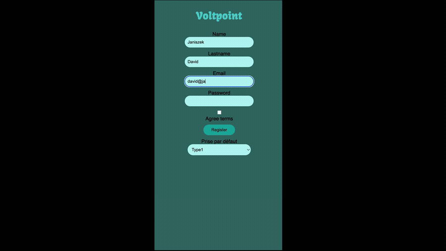

# VoltPoint

[](https://www.php.net/)
[](https://symfony.com/)
[](https://www.doctrine-project.org/)
[](https://www.docker.com/)
[](https://mariadb.org/)
[](https://nginx.org/)
[](https://twig.symfony.com/)

> [Version française du README](README.fr.md)

## Overview

**VoltPoint** is a comprehensive web application designed to locate and manage electric vehicle (EV) charging stations. Built with modern PHP technologies, it provides an intuitive interface for users to find nearby charging points and for administrators to manage the charging infrastructure.

## Project Presentation

[](https://youtu.be/RtGMPg_iEkQ)

*Click on the thumbnail to watch the project presentation on YouTube*

## Features

- **Interactive Map**: Locate EV charging stations using geolocation services
- **Station Management**: Track charging points, EVSE units, and connectors
- **Session Tracking**: Monitor charging sessions and user history
- **User Management**: Role-based access control (Admin/User)
- **Dashboard**: Administrative interface for managing stations and users
- **Secure Authentication**: Login system with role-based permissions

## Technology Stack

### Backend
- **PHP 8.2+**: Modern PHP with strict typing
- **Symfony 7.0**: Full-stack PHP framework
- **Doctrine ORM**: Database abstraction and ORM
- **Twig**: Template engine for views

### Database
- **MariaDB 10.5**: Relational database management

### Infrastructure
- **Docker**: Containerized development environment
- **Nginx**: High-performance web server
- **Docker Compose**: Multi-container orchestration

### Key Libraries
- **Geocoder PHP (Nominatim)**: Geolocation services
- **Nucleos Maps Bundle**: Interactive mapping
- **Symfony Forms**: Form handling and validation
- **Symfony Security**: Authentication and authorization

## Getting Started

### Prerequisites

Before starting, ensure you have the following installed:

- [Docker](https://www.docker.com/) (20.10+)
- [Docker Compose](https://docs.docker.com/compose/) (1.29+)
- [Git](https://git-scm.com/)

### Installation

1. **Clone the repository**
   ```bash
   git clone https://github.com/thmsgo18/VoltPoint.git
   cd VoltPoint
   ```

2. **Configure environment variables**
   ```bash
   cp .env .env.local
   # Edit .env.local with your configuration
   ```

3. **Start Docker containers**
   ```bash
   docker-compose up -d
   ```

4. **Install dependencies**
   ```bash
   docker exec -it php-nginx composer install
   ```

5. **Run database migrations**
   ```bash
   docker exec -it php-nginx php bin/console doctrine:migrations:migrate
   ```

6. **Create an admin user**
   ```bash
   docker exec -it php-nginx php bin/console app:create-admin
   ```

7. **Access the application**
   
   Open your browser and navigate to: `http://localhost`

## Project Structure

```
VoltPoint/
├── config/              # Application configuration
├── docker/              # Docker configuration files
│   ├── nginx/          # Nginx configuration
│   └── php/            # PHP Dockerfile and config
├── migrations/          # Database migrations
├── public/             # Public assets (CSS, JS, entry point)
├── src/                # Application source code
│   ├── Command/        # Console commands
│   ├── Controller/     # Controllers
│   ├── Entity/         # Doctrine entities
│   ├── Form/           # Form types
│   ├── Repository/     # Data repositories
│   └── Security/       # Authentication logic
├── templates/          # Twig templates
├── translations/       # i18n translations
├── var/               # Cache and logs
└── vendor/            # Composer dependencies
```

## Available Commands

### Development

```bash
# Run database migrations
docker exec -it php-nginx php bin/console doctrine:migrations:migrate

# Create admin user
docker exec -it php-nginx php bin/console app:create-admin

# Create connector type
docker exec -it php-nginx php bin/console app:create-connector

# Clear cache
docker exec -it php-nginx php bin/console cache:clear
```

### Docker

```bash
# Start containers
docker-compose up -d

# Stop containers
docker-compose down

# View logs
docker-compose logs -f

# Restart services
docker-compose restart
```

## User Roles

- **Admin**: Full access to manage stations, users, and view all charging sessions
- **User**: Can view stations, start/stop charging sessions, and view personal history

## Database Schema

The application uses the following main entities:

- **User**: Application users with authentication
- **Station**: Physical locations of charging stations
- **EVSE**: Electric Vehicle Supply Equipment units
- **Connector**: Individual charging connectors
- **RechargeSession**: Charging session records

## API Endpoints

The application provides a web interface for:

- User registration and authentication
- Station browsing and searching
- Charging session management
- Administrative dashboard

## Additional Documentation

For more detailed information about the project, please refer to:

- [Docker Setup Guide](Readme%20Docker.md)
- Architecture documentation in **Présentation.pdf**

## Contributing

Contributions are welcome! Please feel free to submit a Pull Request.

1. Fork the project
2. Create your feature branch (`git checkout -b feature/AmazingFeature`)
3. Commit your changes (`git commit -m 'Add some AmazingFeature'`)
4. Push to the branch (`git push origin feature/AmazingFeature`)
5. Open a Pull Request

## License

This project is proprietary software.

## Author

**Thomas** - [thmsgo18](https://github.com/thmsgo18)

## Acknowledgments

- OpenStreetMap & Nominatim for geolocation services
- The Symfony and PHP communities
- All contributors to this project

---

Made with love for the electric vehicle community

